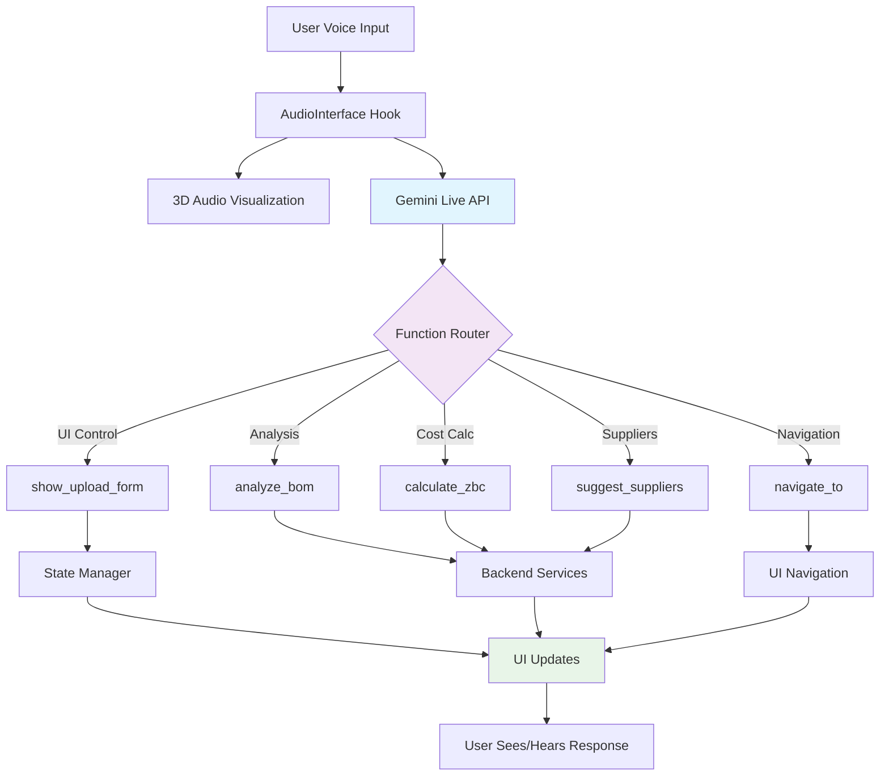
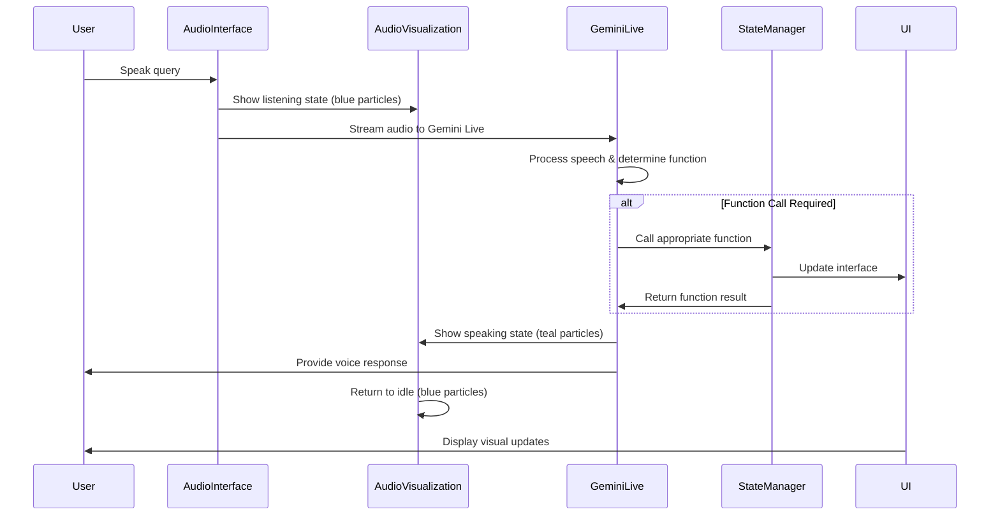
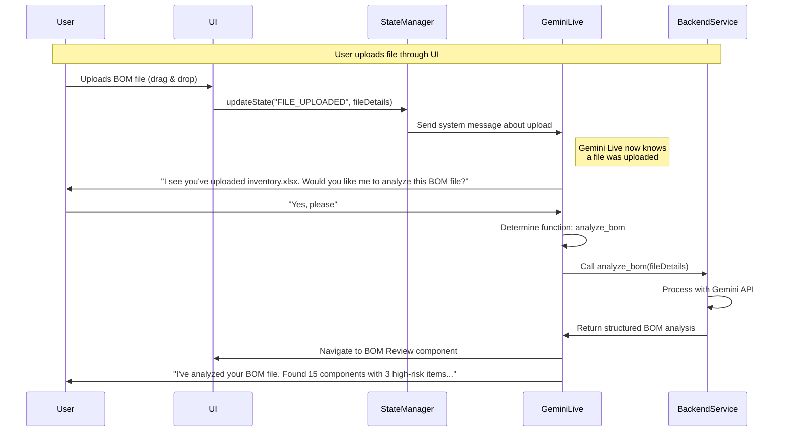
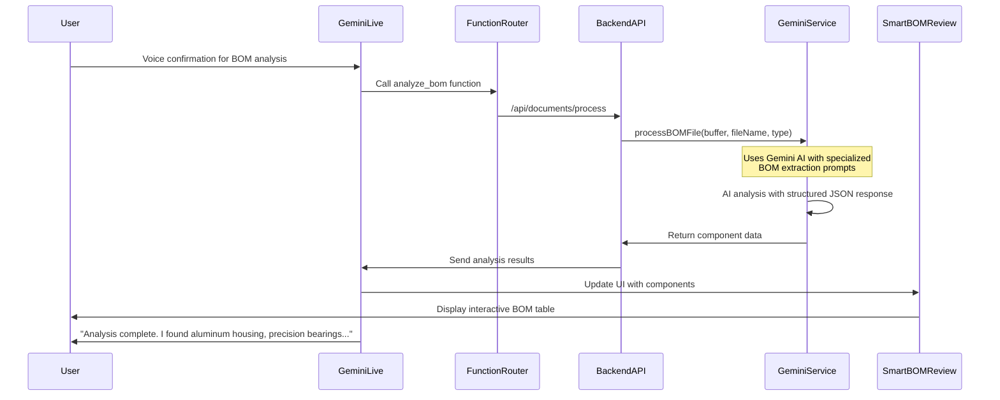
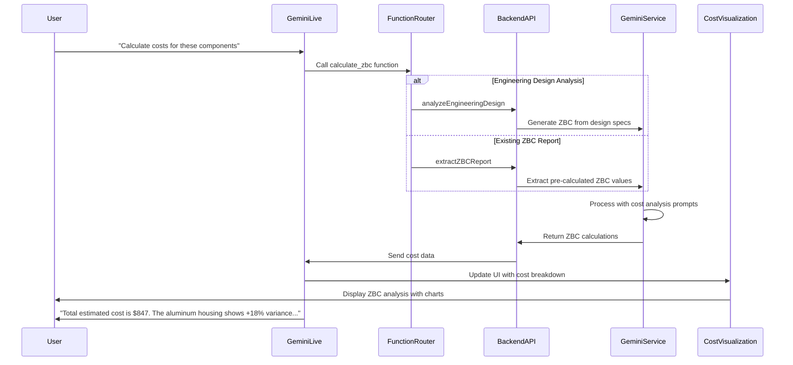
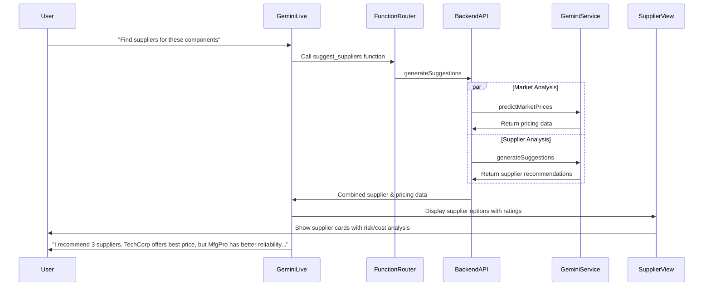
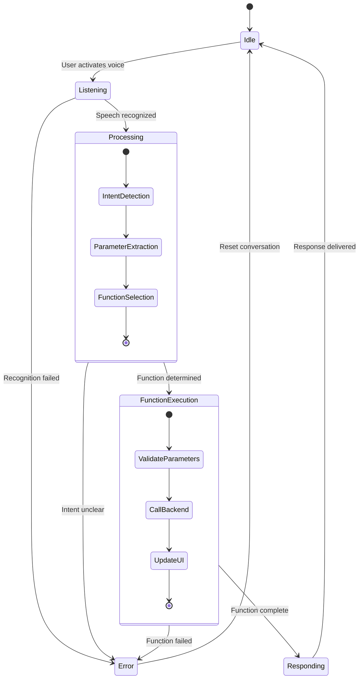
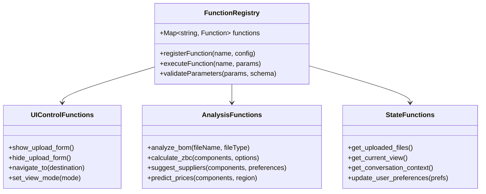
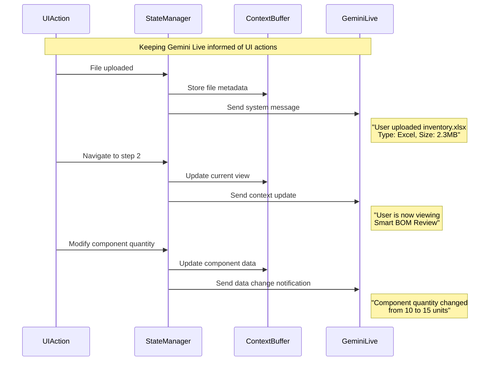
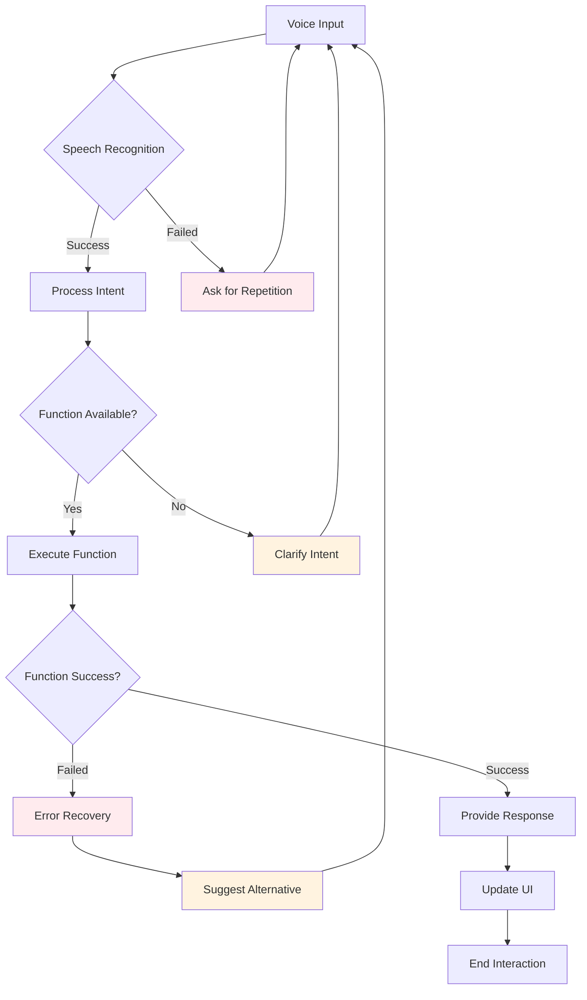

# Voice + AI Architecture Documentation

> 📚 **See Also:** 
> - [Complete Project Architecture](./project-robbie-architecture.md) for full system documentation
> - [Voice-App Command Bus](./voice-app-architecture.md) for bidirectional communication pattern

This document outlines the complete architecture for integrating Gemini Live voice capabilities with the Project Robbie procurement platform.

## Overview

The system leverages Gemini Live's automatic function calling capabilities to create a natural voice interface for procurement workflows. Key features include:

- Real-time voice interaction with 3D audio visualization
- Automatic function selection based on natural language
- Context-aware conversations with UI state synchronization
- Streaming responses with dynamic UI updates

## Core Architecture Components

## 1. Main Voice Interaction Flow

## 2. File Upload & Context Injection Flow

## 3. BOM Analysis Workflow

## 4. ZBC Cost Analysis Flow

## 5. Supplier Recommendation Flow

## 6. State Management Architecture

## 7. Function Definitions Schema

## 8. Context Injection Pattern

## 9. Error Handling & Recovery

## Implementation Checklist

### Frontend Components
- [ ] Integrate Gemini Live WebSocket connection
- [ ] Implement function registry with UI state hooks
- [ ] Create context state manager
- [ ] Connect audio visualization to conversation states
- [ ] Add error handling and recovery flows

### Backend Services
- [ ] Set up Gemini Live API endpoints
- [ ] Implement function call routing
- [ ] Create context injection middleware
- [ ] Add function execution logging
- [ ] Implement streaming response handling

### Function Definitions
- [ ] UI control functions (show/hide forms, navigation)
- [ ] Analysis functions (BOM, ZBC, suppliers)
- [ ] State query functions (files, context, preferences)
- [ ] User preference management

### Testing Strategy
- [ ] Unit tests for function registry
- [ ] Integration tests for voice workflows
- [ ] E2E tests for complete user journeys
- [ ] Error condition testing
- [ ] Performance testing for streaming responses

## Notes

- All diagrams assume Gemini Live is configured with the appropriate function definitions
- State management requires careful synchronization between UI actions and conversation context
- Error handling should provide graceful degradation to text-based interaction when voice fails
- Function parameters should be validated both client-side and server-side
- Conversation context should be persisted across sessions for continuity

---

*Generated: January 2025*
*Version: 1.0*
*Status: Architecture Documentation*
